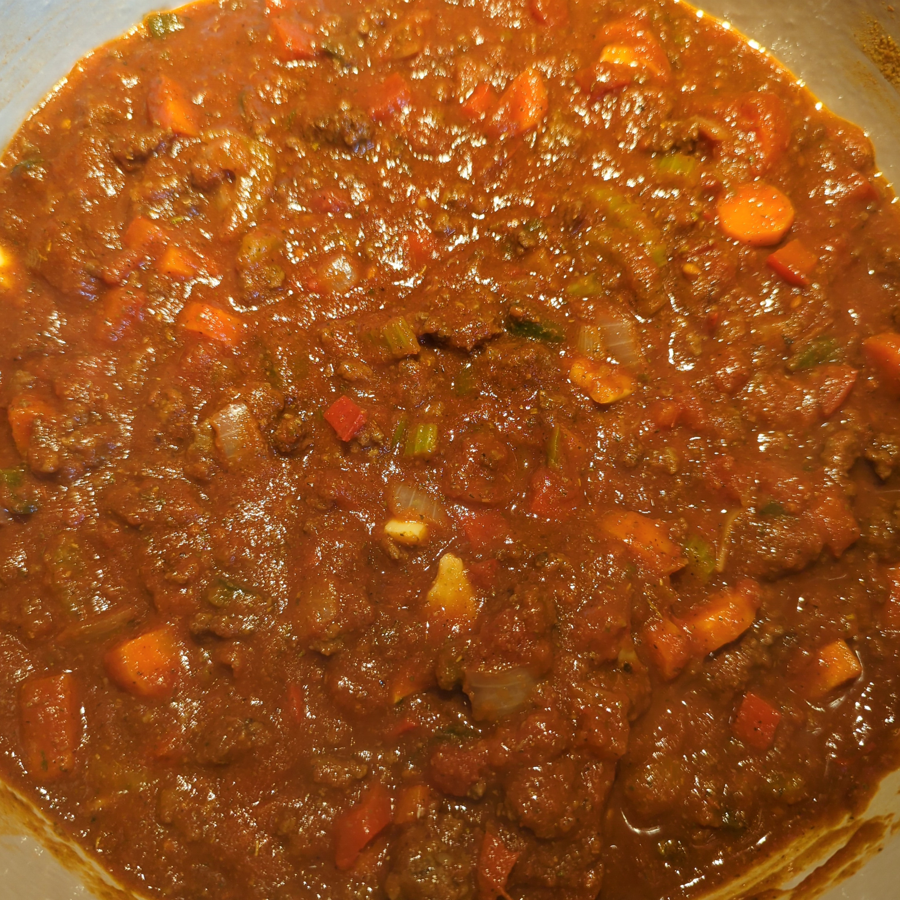

== Chili

=== Ingredients
* 1 Jalapeno Pepper
* 2 Fresno Pepper
* 1 Rd Bell Pepper
* 1 Poblano Pepper
* 2 Serrano Peppers
* 2 Stalks Celery
* 1 Yellow Onion
* 8 Cloves Garlic
* 3 Carrots
* 2 lb ground beef
* 2 tbsp Better than Bouillon
* 1 28oz can Crushed Tomatoes
* 1 14oz can Diced Tomatoes
* 1 6oz can Tomato Paste
* 2 16oz cans Red Kidney Beans
* 1 bottle Amber Beer
* 1 tsp Garlic Powder
* 2 tbsp chili powder
* 2 tbsp ground cumin
* 1 tbsp brown sugar
* 1 tbsp chipotle pepper sauce
* 2 1/2 tsp dried basil
* 1 1/2 tsp smoked paprika
* 1 tsp salt
* 1/2 tsp dried oregano
* 1/2 tsp ground black pepper
